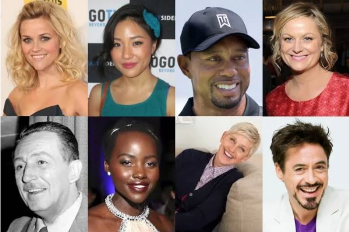
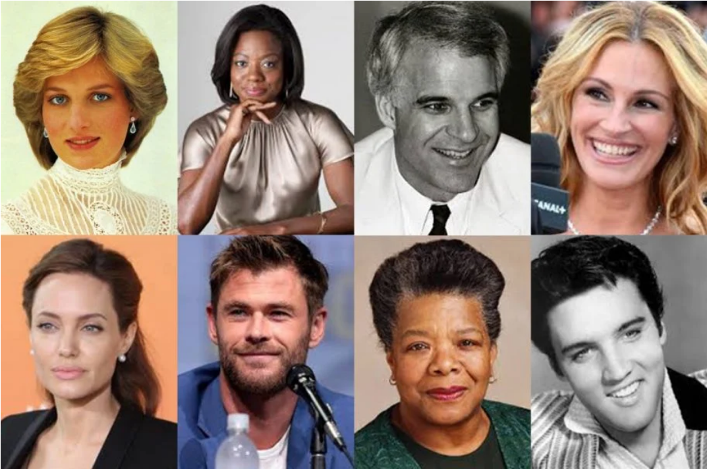
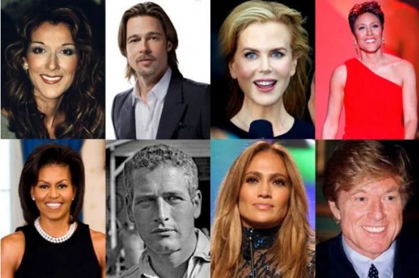
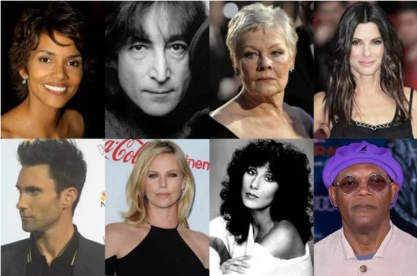

# DYT Multi-Class Classifier

[](https://www.tensorflow.org/)
[](https://www.python.org/)
[](https://keras.io/)
[](https://numpy.org/)
[](https://matplotlib.org/)

A convolutional neural network implementation using TensorFlow for multi-class classification of the four energy profiles defined by Carol Tuttle in Dressing Your Truth. This project demonstrates building a CNN from scratch to recognize the four distinct types of beauty from celebrity images.

## The Four Types of Beauty

Carol Tuttle’s system identifies four distinct Types (Type 1, Type 2, Type 3, Type 4), each with its own natural movement, energy, and style guidelines. The idea is that when you dress in harmony with your Type, you not only look your best but also feel more confident and authentic.

- **Type 1**: Bright, animated, and light energy



- **Type 2**: Soft, subtle, and flowing energy



- **Type 3**: Rich, dynamic, and active energy



- **Type 4**: Bold, striking, and still energy




---

## Table of Contents

- [Project Overview](#project-overview)
- [Dataset Details](#dataset-details)
- [Model Architecture](#model-architecture)
- [Training Process](#training-process)
- [Results](#results)
- [Real-World Applications](#real-world-applications)
- [Installation & Usage](#installation--usage)
- [Key Learnings](#key-learnings)
- [Future Improvements](#future-improvements)
- [Acknowledgments](#acknowledgments)
- [Contact](#contact)
- [Repository Structure](#repository-structure)

---

## Project Overview

This project implements a multi-class convolutional neural network to classify images into one of four Dressing Your Truth style types. The goal is to automate recognition of style profiles based on visual input, supporting personal styling and fashion tech applications.


---

**Key Objectives:**
- Load and preprocess a custom dataset of style images
- Build and train a multi-class CNN for 4-class classification
- Achieve robust accuracy on both training and validation sets
- Visualize model performance and predictions

---

## Dataset Details

**Data Organization:**

```plaintext
project/
│
├── data/
│   ├── train/
│   │   ├── Type1/
│   │   │   ├── img1.jpg
│   │   │   ├── img2.jpg
│   │   │   └── ...
│   │   ├── Type2/
│   │   │   └── ...
│   │   ├── Type3/
│   │   │   └── ...
│   │   └── Type4/
│   │       └── ...
│   ├── val/
│   │   ├── Type1/
│   │   ├── Type2/
│   │   ├── Type3/
│   │   └── Type4/
│   └── test/
│       ├── Type1/
│       ├── Type2/
│       ├── Type3/
│       └── Type4/
│
├── src/
│   ├── model/
│   │   ├── cnn_model.py
│   │   ├── vgg16_model.py
│   │   └── ...
│   ├── dataset.py
│   ├── train.py
│   ├── eval.py
│   └── predict.py
│
├── config/
│   └── config.yml
│
├── log/
│   └── (TensorBoard logs, etc.)
│
├── model/
│   └── (Saved trained models)
│
├── requirements.txt
└── README.md


---

## Model Architecture 🧠

A sample CNN architecture for 4-class classification:

```python
def create_model():
    model = tf.keras.models.Sequential([
        tf.keras.Input(shape=(IMG_HEIGHT, IMG_WIDTH, 3)),
        tf.keras.layers.Rescaling(1./255),
        tf.keras.layers.Conv2D(32, (3, 3), activation='relu', padding='same'),
        tf.keras.layers.MaxPooling2D((2, 2)),
        tf.keras.layers.Conv2D(64, (3, 3), activation='relu', padding='same'),
        tf.keras.layers.MaxPooling2D((2, 2)),
        tf.keras.layers.Flatten(),
        tf.keras.layers.Dense(128, activation='relu'),
        tf.keras.layers.Dropout(0.5),
        tf.keras.layers.Dense(4, activation='softmax')
    ])
    model.compile(
        optimizer='adam',
        loss='categorical_crossentropy',
        metrics=['accuracy']
    )
    return model
```

---

Here's the corrected version with proper Markdown formatting for bullet points:

---

## Training Process 🏋️

- Train for 15-20 epochs (adjust as needed)  
- Use categorical crossentropy loss and Adam optimizer  
- Monitor both training and validation accuracy  

---

## Results 📈

- Report accuracy, confusion matrix, and sample predictions  
- Include plots of training and validation accuracy/loss  

---

## Real-World Applications 🌍

- Automated profiling for the four distinct types
- Natural movement, energy, and style guidelines  
- Virtual personal styling and self-development assistants

---

## Installation & Usage 🚀  
**Prerequisites**  
- Python 3.6+  
- TensorFlow 2.x  
- NumPy  
- Matplotlib  

---

## Key Learnings 💡

- Multi-class image classification with deep learning  
- Data organization for scalable ML projects  
- Model evaluation and visualization  

---

## Future Improvements 🚀

- Data augmentation for improved generalization  
- Advanced architectures (e.g., MobileNet, ResNet)  
- Deployment as a web app  

---

## Acknowledgments 🙏

- Inspired by Dressing Your Truth by Carol Tuttle  
- Thanks to the open-source ML community  

---

## Contact 📫

For inquiries about this project:
- [LinkedIn Profile](https://www.linkedin.com/in/melissaslawsky/)
- [Client Results](https://melissaslawsky.com/portfolio/)
- [Tableau Portfolio](https://public.tableau.com/app/profile/melissa.slawsky1925/vizzes)
- [Email](mailto:melissa@melissaslawsky.com)

---

© 2025 Melissa Slawsky. All Rights Reserved.
