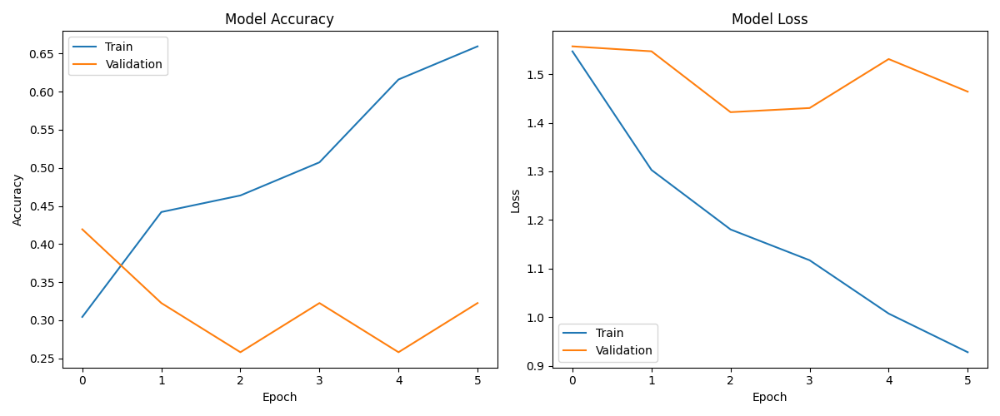

# DYT Multi-Class Classifier

[](https://www.tensorflow.org/)
[](https://www.python.org/)
[](https://keras.io/)
[](https://numpy.org/)
[](https://matplotlib.org/)

A convolutional neural network implementation using TensorFlow for multi-class classification of the four energy profiles defined by Carol Tuttle in Dressing Your Truth. This project demonstrates building a CNN from scratch to recognize the four distinct types of beauty from celebrity images.

## The Four Types of Beauty

Carol Tuttle’s system identifies four distinct Types (Type 1, Type 2, Type 3, Type 4), each with its own natural movement, energy, and style guidelines. The idea is that when you dress in harmony with your Type, you not only look your best but also feel more confident and authentic.

Individuals exhibit a primary and secondary type.

- **Type 1**: Bright, animated, and light energy


- **Type 2**: Soft, subtle, and flowing energy


- **Type 3**: Rich, dynamic, and active energy


- **Type 4**: Bold, striking, and still energy


---

## Table of Contents

- [Project Overview](#project-overview)
- [Dataset Details](#dataset-details)
- [Model Architecture](#model-architecture)
- [Training Process](#training-process)
- [Results](#results)
- [Real-World Applications](#real-world-applications)
- [Installation & Usage](#installation--usage)
- [Key Learnings](#key-learnings)
- [Future Improvements](#future-improvements)
- [Acknowledgments](#acknowledgments)
- [Contact](#contact)
- [Repository Structure](#repository-structure)

---

## Project Overview

This project implements a multi-class convolutional neural network to classify images into one of four Dressing Your Truth style types. The goal is to automate recognition of style profiles based on visual input, supporting personal styling and lifestyle recommendations.


---

**Key Objectives:**
- Load and preprocess a custom dataset of style images
- Build and train a multi-class CNN for 4-class classification
- Achieve robust accuracy on both training and validation sets
- Visualize model performance and predictions

---

## Dataset Details

**Data Organization:**

```plaintext
project/
│
├── data/
│   ├── train/
│   │   ├── Type1/
│   │   │   ├── img1.jpg
│   │   │   ├── img2.jpg
│   │   │   └── ...
│   │   ├── Type2/
│   │   │   └── ...
│   │   ├── Type3/
│   │   │   └── ...
│   │   └── Type4/
│   │       └── ...
│   ├── val/
│   │   ├── Type1/
│   │   ├── Type2/
│   │   ├── Type3/
│   │   └── Type4/
│   └── test/
│       ├── Type1/
│       ├── Type2/
│       ├── Type3/
│       └── Type4/
│
├── src/
│   ├── model/
│   │   ├── cnn_model.py
│   │   ├── vgg16_model.py
│   │   └── ...
│   ├── dataset.py
│   ├── train.py
│   ├── eval.py
│   └── predict.py
│
├── config/
│   └── config.yml
│
├── log/
│   └── (TensorBoard logs, etc.)
│
├── model/
│   └── (Saved trained models)
│
├── requirements.txt
└── README.md


---

## Model Architecture 🧠

A sample CNN architecture for 4-class classification:

```python
def create_model():
    model = tf.keras.models.Sequential([
        tf.keras.Input(shape=(IMG_HEIGHT, IMG_WIDTH, 3)),
        tf.keras.layers.Rescaling(1./255),
        tf.keras.layers.Conv2D(32, (3, 3), activation='relu', padding='same'),
        tf.keras.layers.MaxPooling2D((2, 2)),
        tf.keras.layers.Conv2D(64, (3, 3), activation='relu', padding='same'),
        tf.keras.layers.MaxPooling2D((2, 2)),
        tf.keras.layers.Flatten(),
        tf.keras.layers.Dense(128, activation='relu'),
        tf.keras.layers.Dropout(0.5),
        tf.keras.layers.Dense(4, activation='softmax')
    ])
    model.compile(
        optimizer='adam',
        loss='categorical_crossentropy',
        metrics=['accuracy']
    )
    return model
```


---

# DYT Multi-Class Classifier - Phase 1 Trial: Baseline Performance

## Phase 1 Overview: Multi-Class Classification with Celebrity Images

### Goals
- Establish baseline performance with unprocessed celebrity images
- Train a simple CNN to classify all 4 DYT types
- Document initial accuracy metrics for comparison
- Identify challenges to address in subsequent phases

### Timeline
- **Phase 1**: Baseline multi-class classifier with raw images
- **Phase 2**: Add image preprocessing (cropping/background removal)
- **Phase 3**: Implement data augmentation
- **Phase 4**: Architecture improvements

---

## Phase 1 Implementation Plan

### 1. Data Collection & Organization
```
data/
├── train/
│   ├── Type1/  # Type 1 celebrity images from DYT site
│   ├── Type2/  # Type 2 celebrity images from DYT site
│   ├── Type3/  # Type 3 celebrity images from DYT site
│   └── Type4/  # Type 4 celebrity images from DYT site
└── val/
    ├── Type1/  # 20% of images for validation
    ├── Type2/
    ├── Type3/
    └── Type4/
```

---

### 2. Initial Dataset Statistics
- Number of images per type
- Image dimensions and formats
- Class balance analysis

---

### 3. Simple CNN Architecture
```python
def create_baseline_model():
    model = tf.keras.Sequential([
        tf.keras.layers.Rescaling(1./255, input_shape=(224, 224, 3)),
        tf.keras.layers.Conv2D(32, (3, 3), activation='relu'),
        tf.keras.layers.MaxPooling2D((2, 2)),
        tf.keras.layers.Conv2D(64, (3, 3), activation='relu'),
        tf.keras.layers.MaxPooling2D((2, 2)),
        tf.keras.layers.Conv2D(128, (3, 3), activation='relu'),
        tf.keras.layers.MaxPooling2D((2, 2)),
        tf.keras.layers.Flatten(),
        tf.keras.layers.Dense(128, activation='relu'),
        tf.keras.layers.Dropout(0.5),
        tf.keras.layers.Dense(4, activation='softmax')
    ])
    
    model.compile(
        optimizer='adam',
        loss='sparse_categorical_crossentropy',
        metrics=['accuracy']
    )
    return model
```
---

### 4. Training Configuration
- Batch size: 32
- Epochs: 20 (for baseline)
- Image size: 224x224
- No data augmentation (baseline)
- 80/20 train/validation split

---

### 5. Metrics to Track
- Training accuracy
- Validation accuracy
- Confusion matrix
- Per-class precision/recall
- Training time
- Loss curves

---

### 6. Expected Challenges
- Class imbalance
- Background noise in images
- Inconsistent image qualities
- Small dataset size

---

## Phase 1: Baseline Results 📈

### Model Performance

The initial phase established a baseline model using MobileNetV2 with aspect ratio preservation. The model achieved:

- **Best Validation Accuracy**: 41.94% (achieved in epoch 1)
- **Final Training Accuracy**: 65.94% 
- **Early Stopping**: Triggered after 6 epochs due to validation accuracy not improving



The learning curves reveal a classic case of overfitting, with training accuracy steadily increasing to 65.94% while validation accuracy decreased from its initial peak of 41.94% to 32.26% by epoch 6.

precision    recall  f1-score   support

  Type 1       0.43      1.00      0.60        12
  Type 2       0.50      0.17      0.25         6
  Type 3       0.00      0.00      0.00         5
  Type 4       0.00      0.00      0.00         8

accuracy                           0.42        31


The confusion matrix shows a striking pattern:


**Key observations**:
1. The model classified almost everything as Type 1
2. Only 1 Type 2 sample was correctly identified
3. No Type 3 or Type 4 samples were correctly classified
4. Type 1 achieved 100% recall but only 43% precision

### Sample Predictions

The prediction samples demonstrate the strong bias toward Type 1:


All 12 samples shown were classified as Type 1, regardless of their true type. This indicates a significant class imbalance issue in the training data.

---

### Personal Testing Results 👤

When testing the model on my own images (as a known Type 2/4 according to Carol Tuttle), interesting patterns emerged:

#### Test 1: With pre-processed image


#### Test 2: Original image


Surprisingly, the model consistently classified me as Type 4 with high confidence, even though I'm professionally typed as a Type 2/4 combination. The model seems to prioritize visual Type 4 characteristics over my primary Type 2 energy.

### Analysis and Challenges

Phase 1 revealed several key challenges:

1. **Extreme Class Imbalance**: The model heavily favors Type 1, suggesting an imbalanced training dataset
2. **Validation Degradation**: Decreasing validation accuracy despite increasing training accuracy indicates overfitting
3. **Insufficient Training Data**: With only 138 training images across 4 classes, the model struggles to generalize
4. **Feature Representation**: The model may be focusing on limited facial features rather than overall energy patterns

The aspect ratio preservation technique worked well for maintaining proper image proportions, but the model's classification performance requires significant improvement.

### Next Steps for Phase 1B

Based on these findings, Phase 1B will address:

1. **Class Balancing**: Implement class weights or augmentation to balance the influence of each type
2. **Face Detection**: Add face detection to focus the model on facial features
3. **Feature Extraction Fine-tuning**: Unfreeze later layers of MobileNetV2 to improve feature extraction
4. **Regularization**: Add additional regularization techniques to combat overfitting
5. **Data Analysis**: Identify what visual features are driving Type 4 classifications

### Class-Specific Performance

---

## Next Steps (Phase 2 Preview)

### Image Preprocessing Pipeline
1. Face detection and cropping
2. Background removal
3. Image standardization
4. Color normalization

### Expected Improvements
- Better focus on facial features
- Reduced background noise
- More consistent input data
- Improved model generalization

---

## Training Process 🏋️

- Train for 15-20 epochs (adjust as needed)  
- Use categorical crossentropy loss and Adam optimizer  
- Monitor both training and validation accuracy  

---

## Results 📈

- Report accuracy, confusion matrix, and sample predictions  
- Include plots of training and validation accuracy/loss  

---

## Real-World Applications 🌍

- Automated profiling for the four distinct types
- Natural movement, energy, and style guidelines  
- Virtual personal styling and self-development assistants

---

## Installation & Usage 🚀  
**Prerequisites**  
- Python 3.6+  
- TensorFlow 2.x  
- NumPy  
- Matplotlib  

---

## Key Learnings 💡

- Multi-class image classification with deep learning  
- Data organization for scalable ML projects  
- Model evaluation and visualization  

---

## Future Improvements 🚀

- Data augmentation for improved generalization  
- Advanced architectures (e.g., MobileNet, ResNet)  
- Deployment as a web app  

---

## Acknowledgments 🙏

- Inspired by Dressing Your Truth by Carol Tuttle  
- Thanks to the open-source ML community  

---

## Contact 📫

For inquiries about this project:
- [LinkedIn Profile](https://www.linkedin.com/in/melissaslawsky/)
- [Client Results](https://melissaslawsky.com/portfolio/)
- [Tableau Portfolio](https://public.tableau.com/app/profile/melissa.slawsky1925/vizzes)
- [Email](mailto:melissa@melissaslawsky.com)

---

© 2025 Melissa Slawsky. All Rights Reserved.
